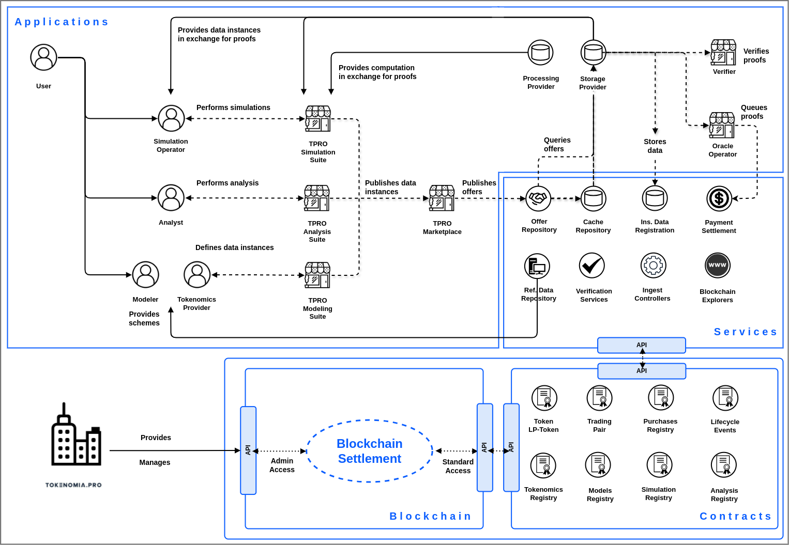

# Introduction

TPRO network is a blockchain-based ecosystem that enables modeling, simulating, reporting and verifying of tokenomics models. TPRO Network stands as a transformative force in the cryptocurrency space, revolutionizing transparency in tokenomics and paving the way for more sustainable projects. Currently, TPRO Network operates on centralized solutions based on cloud infrastructure, providing applications and tools to its users. While this centralized approach offers convenience and scalability, it comes with several drawbacks, particularly in terms of operational efficiency and uptime reliability.

<figure><figcaption>
Proposed Architecture
</figcaption></figure>

One of the primary issues with hosting ecosystems in a centralized manner is the operational burden it imposes. Centralized servers and storage databases require constant maintenance and supervision, leading to increased operational costs and resource allocation. Moreover, relying on centralized solutions leaves the network vulnerable to downtime and outages, disrupting service availability and user experience. The cost of running a centralized hosting can quickly escalate, especially as the network grows and demand increases. This not only strains the financial resources of operators but also limits scalability and expansion opportunities.

Transitioning to a decentralized architecture offers a viable solution to address these challenges. Decentralization distributes the hosting responsibilities across a network of providers, eliminating the reliance on a single point of failure and reducing the risk of downtime. Additionally, by embracing decentralization, TPRO Network operators can benefit from improved operational efficiency, reduced hosting costs, and enhanced reliability. Decentralization empowers operators to leverage existing resources more effectively and ensures uninterrupted service delivery to end-users.

For end-users, decentralization brings a host of benefits, including increased transparency, fairness, and security. With decentralized solutions, users can trust that their data is stored securely and accessed only by authorized parties. Furthermore, decentralization promotes inclusivity and accessibility, allowing users to participate in the network without discrimination or censorship. Transitioning from centralized to decentralized architecture holds immense promise for enhancing the reliability and transparency of TPRO Network. In the following sections, we will delve into the proposed architecture for TPRO Network's decentralization, outlining the specific solutions and benefits it offers to both network operators and end-users.
